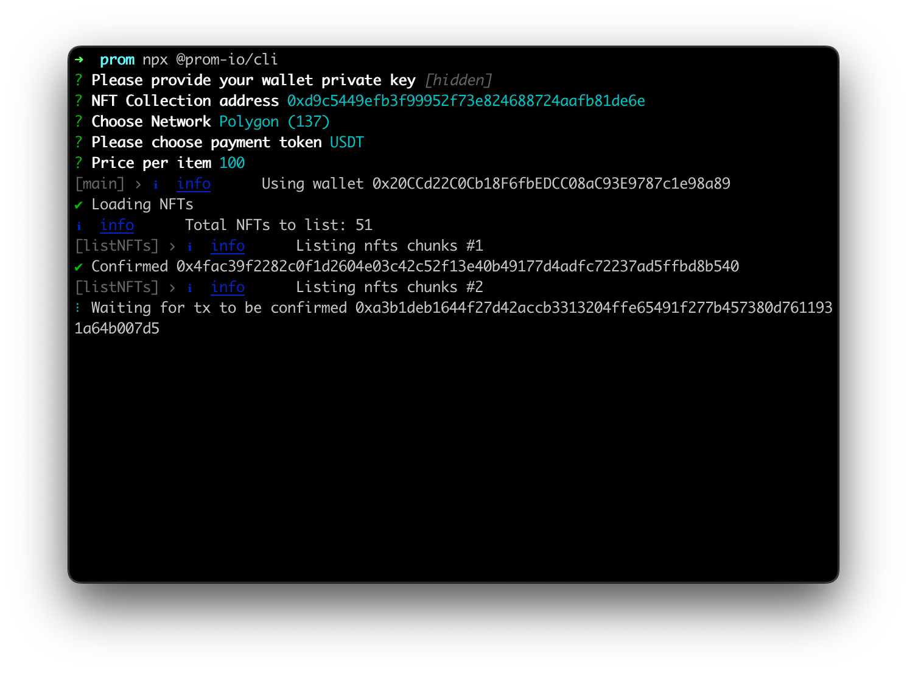

# Prom CLI


Prom is the world's first all-in-one NFT gaming platform with a marketplace and other attractive options.

Prom CLI lists multiple NFTs on the marketplace.



### Usage

#### Using `npx`

```sh
npx @prom-io/cli@latest
```

##### Installing globally

```sh
npm i -g @prom-io/cli
prom-cli --version
```

```
Usage: prom-cli [options] [command]

Prom CLI allows to list multiple NFTs blazing fast

Options:
  -V, --version               output the version number
  -m --marketplace <address>  custom marketplace address
  --max-fee <price>           max fee per gas (max gas price non EIP-1559 compatible chains) in GWEI
  --max-priority-fee <price>  max priority fee per gas in GWEI
  --speed <speed>             tx speed (fastest, fast, medium, slow) (default: "medium")
  -r --rpc <url>              custom rpc
  -h, --help                  display help for command

Commands:
  delist
  cancel-txns                 cancel pending transactions up to nonce
  clear-cache
```

##### Listing NFTs

To list NFTs simply run next command and follow the instructions.

```
npx @prom-io/cli
```

##### Delisting NFTs

To delist NFTs simply run next command and follow the instructions.

```
npx @prom-io/cli delist
```

#### Troubleshooting

If you see message `Total NFTs to list: 0` however you're sure that there are NFTs to list run the following command

```
npx @prom-io/cli clear-cache
```

### Development

#### Install dependencies

```
npm install
```

#### Build

```
npm run build
```

#### Run

```
npm run start
```

#### Test

```
npm run test
```
